# Week 5 Assignment
## Task 2
- **Create a new database named  website.** 

    *MyAQL語法*
    ```sql
    CREATE DATABASE website;
    ```
    *結果*  
    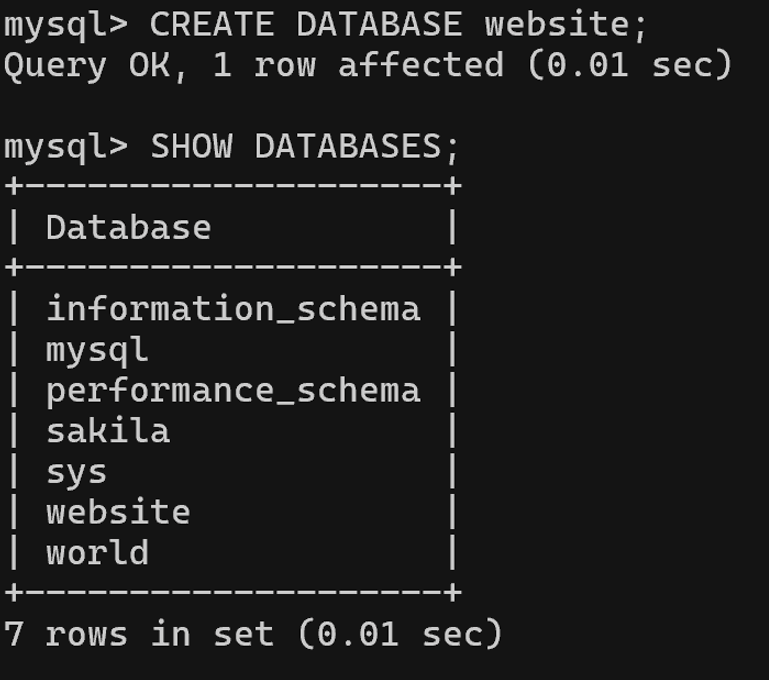
-  **Create a new table named  member  , in the  website  database,  designed as below:**  

    | Column Name     | Description                                                                                   |
    | ---------------- | --------------------------------------------------------------------------------------------- |
    | id               | Unique ID for Member in Non-Negative Integer. Primary Key. Auto Increment.                    |
    | name             | Name < 255 Characters. Cannot be Empty.                                                       |
    | email            | Email < 255 Characters. Cannot be Empty.                                                      |
    | password         | Password < 255 Characters. Cannot be Empty.                                                   |
    | follower_count   | Follower Count in Non-Negative Integer. Cannot be Empty. Default to 0.                        |
    | time             | Signup DateTime. Cannot be Empty. Default to Current Time.                                    |  

    *MyAQL語法*
    ```sql
    USE website;
    CREATE TABLE member (
        id INT UNSIGNED AUTO_INCREMENT PRIMARY KEY,
        name VARCHAR(255) NOT NULL,
        email VARCHAR(255) NOT NULL,
        password VARCHAR(255) NOT NULL,
        follower_count INT UNSIGNED NOT NULL DEFAULT 0,
        time DATETIME NOT NULL DEFAULT CURRENT_TIMESTAMP);
    ```
    *結果*  
    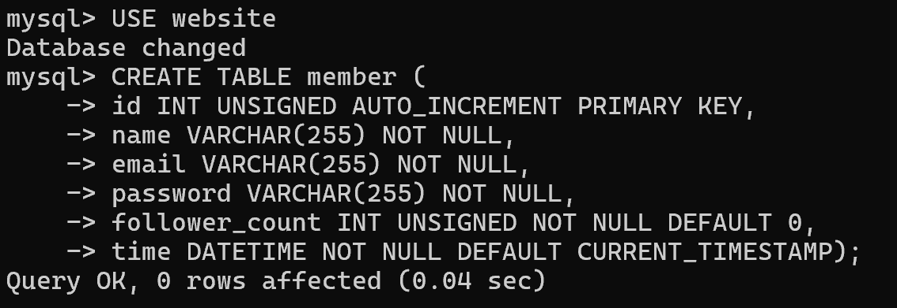
    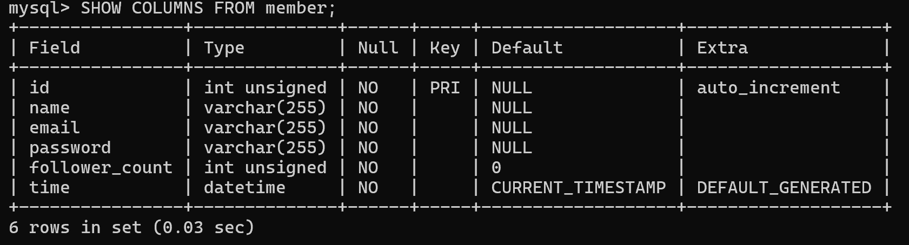  

## Task 3
-  **INSERT a new row to the member table where name, email and password must be set to  test ,  test@test.com , and  test . INSERT additional  4 rows with arbitrary data.**  
    *MyAQL語法*
    ```sql
    INSERT INTO member (name, email, password)
    VALUES ('test', 'test@test.com', 'test');
    INSERT INTO member (name, email, password)
    VALUES ('Alice', 'Alice1010@test.com', '1010Alice');
    INSERT INTO member (name, email, password)
    VALUES ('Bob', 'youknowbob@test.com', 'YesIKnow');
    INSERT INTO member (name, email, password)
    VALUES ('Cindy', 'cindyiscute@test.com', 'ABCabc123');
    INSERT INTO member (name, email, password)
    VALUES ('Cindy', 'cindyiscute@test.com', 'ABCabc123');
    INSERT INTO member (name, email, password)
    VALUES ('Diana', 'disneyland@test.com', 'MickeyMouse');
    ```
    *結果*  
    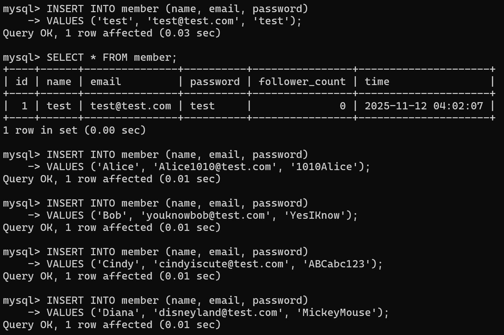
    
-   **SELECT all rows from the member table.**    
    *MyAQL語法*
    ```sql
    SELECT * FROM member;
    ```
    *結果*  
    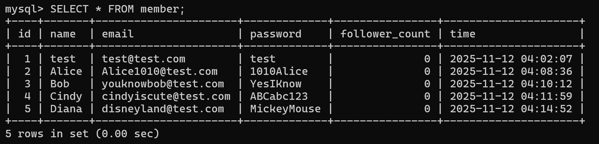

-  **SELECT all rows from the member table, in descending order of time.**  
    *MyAQL語法*
    ```sql
    SELECT * FROM member
    ORDER BY time DESC;
    ```
    *結果*  
    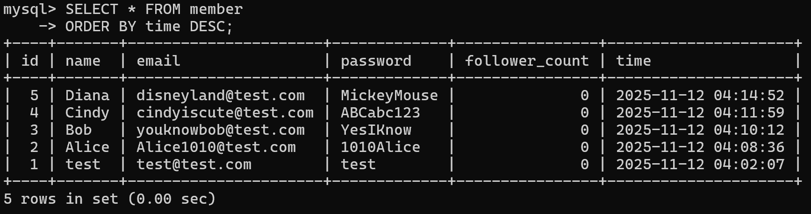

-   **SELECT total 3 rows, second to fourth, from the member table, in descending order of time.**  
    *MyAQL語法*
    ```sql
    SELECT * FROM member
    ORDER BY time DESC
    LIMIT 3 OFFSET 1;
    ```
    *結果*  
    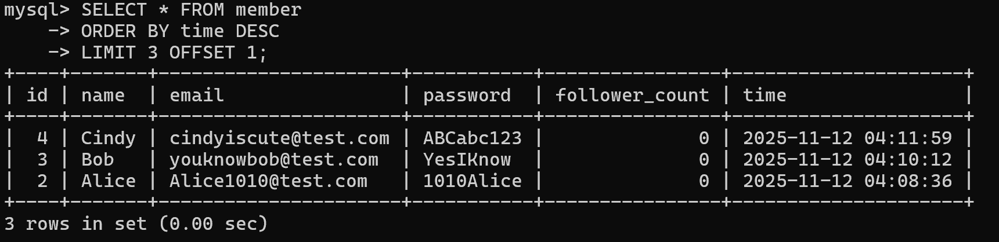

-   **SELECT rows where email equals to  test@test.com .**   
    *MyAQL語法*
    ```sql
    SELECT * FROM member
    WHERE email = 'test@test.com';
    ```
    *結果*  
    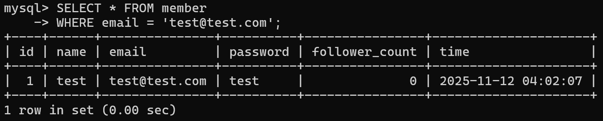

-   **SELECT rows where name includes the  es  keyword.**  
    *MyAQL語法*
    ```sql
    SELECT * FROM member
    WHERE name LIKE '%es%';
    ```
    *結果*  
    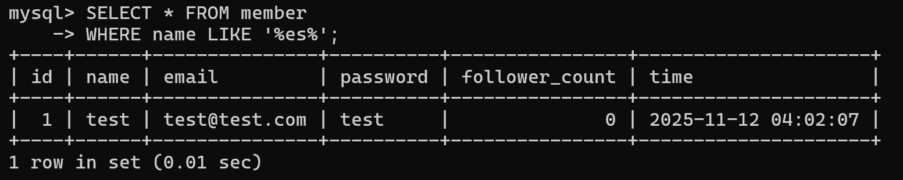

-   **SELECT rows where email equals to  test@test.com  and  password equals to  test .**  
    *MyAQL語法*
    ```sql
    SELECT * FROM member
    WHERE email = 'test@test.com' and password = 'test';
    ```
    *結果*  
    

-   **UPDATE data in name column to  test2  where email equals  to  test@test.com .**  
    *MyAQL語法*
    ```sql
    UPDATE member
    SET name = 'test2'
    WHERE email = 'test@test.com';
    ```
    *結果*  
    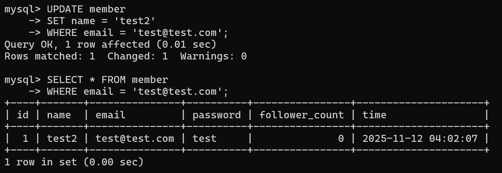

## Task 4
-   **SELECT how many rows from the member table.**  
    *MyAQL語法*
    ```sql
    SELECT COUNT(*) FROM member;
    ```
    *結果*  
    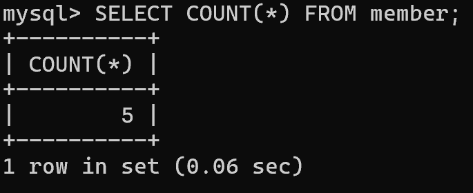

-   **SELECT the sum of follower_count of all the rows from the member table.**  
    *MyAQL語法*
    ```sql
    SELECT SUM(follower_count) FROM member;
    ```
    *結果*  
    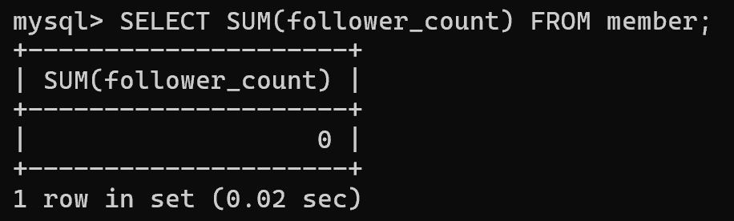

-   **SELECT the average of follower_count of all the rows from the member table.**  
    *MyAQL語法*
    ```sql
    SELECT AVG(follower_count) FROM member;
    ```
    *結果*  
    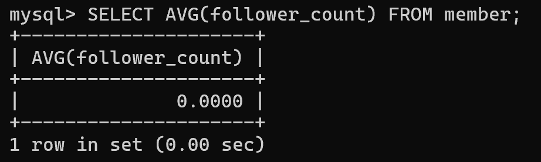

-   **SELECT the average of follower_count of the first 2 rows, in descending order of follower_count, from the member table.**  
    *MyAQL語法*
    ```sql
    SELECT AVG(follower_count)
    FROM (
        SELECT * FROM member
        ORDER BY follower_count DESC
        LIMIT 2
    ) AS top2
    ```
    *結果*  
    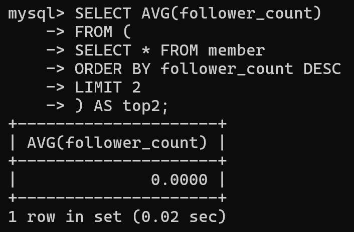

## Task 5
-   **Create a new table named  message  , in the  website  database.  designed as below:** 

    | Column Name | Description |
    | --- | --- |
    | id |   Unique ID for Message in Non-Negative Integer. Primary Key. Auto Increment. |
    | member_id | Member ID for Message Sender. Cannot be Empty. Must be Foreign Key refer to the id column in the member table. |
    | content | Content < 65535 Characters. Cannot be Empty. |
    | like_count | Like Count in Non-Negative Integer. Cannot be Empty. Default to 0. |
    | time | Publish DateTime. Cannot be Empty. Default to Current Time. |

    *MyAQL語法*
    ```sql
    CREATE TABLE message (
    id INT UNSIGNED AUTO_INCREMENT PRIMARY KEY,
    member_id INT UNSIGNED NOT NULL,
    content TEXT NOT NULL,
    like_count INT UNSIGNED NOT NULL DEFAULT 0,
    time DATETIME NOT NULL DEFAULT CURRENT_TIMESTAMP,
    FOREIGN KEY (member_id) REFERENCES member(id)
    );
    ```
    *結果*  
    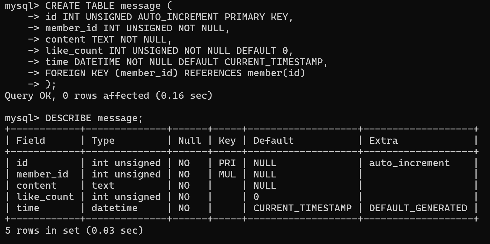

-   **SELECT all messages, including sender names. We have to JOIN the member table to get that.**  
    *MyAQL語法*
    ```sql
    SELECT message.*, member.name
    FROM message
    LEFT JOIN member
    ON message.member_id = member.id;
    ```
    *結果*  
    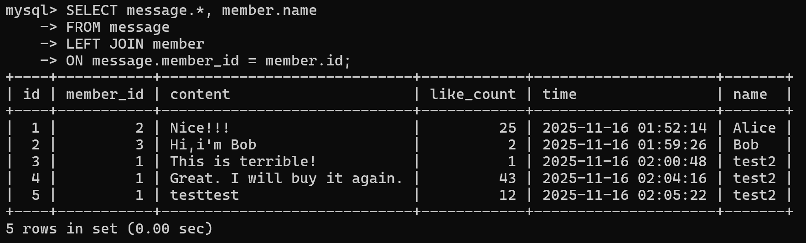

-   **SELECT all messages, including sender names, where sender email equals to test@test.com . We have to JOIN the member table to  filter and get that.**  
    *MyAQL語法*
    ```sql
    SELECT message.*, member.name
    FROM message
    JOIN member
    ON message.member_id = member.id
    WHERE member.email = 'test@test.com';
    ```
    *結果*  
    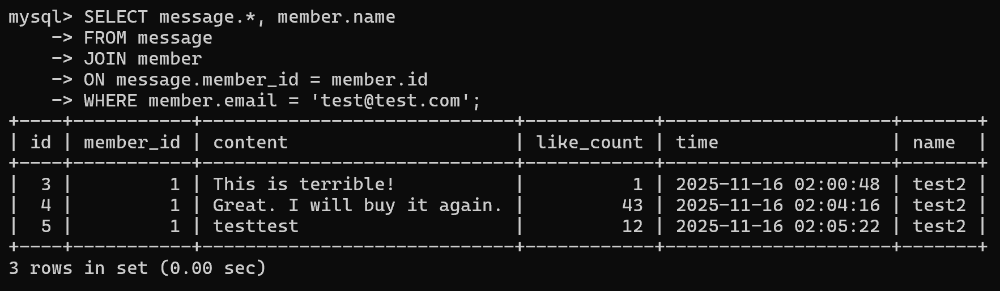

-   **Use SELECT, SQL Aggregation Functions with JOIN statement, get the average like count of messages where sender email equals to  test@test.com .**  
    *MyAQL語法*
    ```sql
    SELECT AVG(message.like_count) FROM message
    JOIN member ON message.member_id = member.id
    WHERE member.email = 'test@test.com';
    ```
    *結果*  
    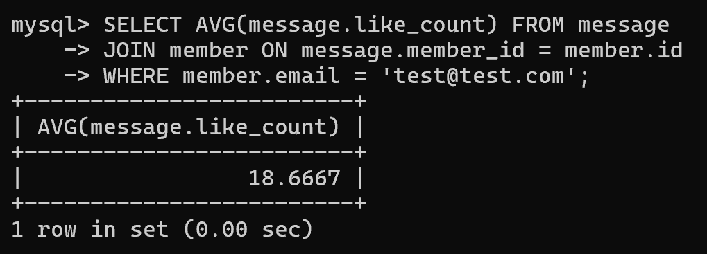

-   **Use SELECT, SQL Aggregation Functions with JOIN statement, get the average like count of messages GROUP BY sender email.**  
    *MyAQL語法*
    ```sql
    SELECT member.email, AVG(message.like_count) FROM message
    JOIN member ON message.member_id = member.id
    GROUP BY member.email;
    ```
    *結果*  
    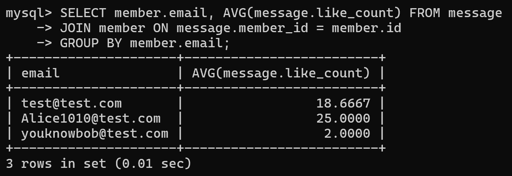
